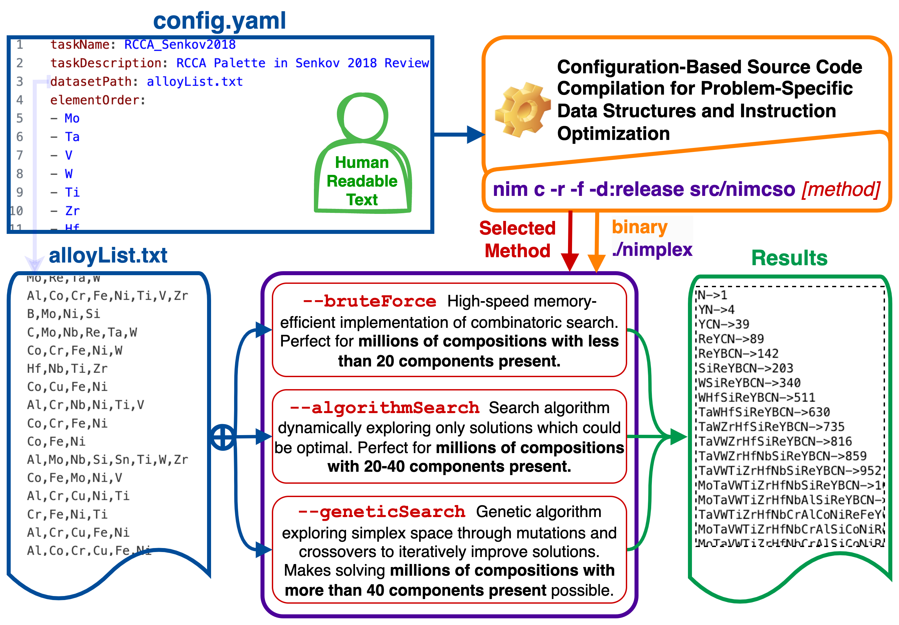

# (nim) Composition Space Optimization

[](https://nimcso.phaseslab.org)
[](https://opensource.org/licenses/MIT)
[](paper/paper.pdf)
[](https://doi.org/10.48550/arXiv.2403.02340)

[](https://github.com/amkrajewski/nimCSO/actions/workflows/testingOnPush_Apple.yaml)
[](https://github.com/amkrajewski/nimCSO/actions/workflows/testingOnPush_Linux.yaml)
[](https://github.com/amkrajewski/nimCSO/actions/workflows/testingOnPush_Windows.yaml)

**nim** **C**omposition **S**pace **O**ptimization is a high-performance tool implementing several methods for selecting components (data dimensions) in compositional datasets, which 
optimize the data availability and density for applications such as machine learning (ML) given a constraint on the number of components to be selected, so that they can be designed in a way balancing their accuracy and domain of applicability. Making said choice is a *combinatorically hard 
problem when data is composed of a large number of independent components due to the interdependency of components being present*. Thus, efficiency of the search becomes critical for any
application where interaction between components is of interest in a modeling effort, ranging:
- from market **economics**,
- through **medicine** where drug interactions can have a significant impact on the treatment, 
- to **materials science**, where the composition and processing history are critical to resulting properties.

We are particularily interested in the latter case of materials science, where we utilize `nimCSO` to optimize ML deployment over our datasets on Compositionally Complex Materials (CCMs) 
which are largest ever collected (from almost 550 publications) spanning up to 60 dimensions and developed within the [ULTERA Project (ultera.org)](https://ultera.org) carried under the 
[US DOE ARPA-E ULTIMATE](https://arpa-e.energy.gov/?q=arpa-e-programs/ultimate) program which aims to develop 
a new generation of ultra-high temperature materials for aerospace applications, through generative machine learning models [10.20517/jmi.2021.05](https://doi.org/10.20517/jmi.2021.05)
driving thermodynamic modeling and experimentation [10.2139/ssrn.4689687](https://dx.doi.org/10.2139/ssrn.4689687).

At its core, `nimCSO` leverages the **metaprogramming** ability of the [Nim language](https://nim-lang.org) to optimize itself at the compile time, both in terms of speed and memory handling, 
to the specific problem statement and dataset at hand based on a human-readable configuration file. As demonstrated later in benchamrks, `nimCSO` reaches the physical limits of the hardware 
(L1 cache latency) and can outperform an efficient native Python implementation over 400 times in terms of speed and 50 times in terms of memory usage (*not* counting interpreter), while 
also outperforming NumPy implementation 35 and 17 times, respectively, when checking a candidate solution.



`nimCSO` is designed to be both (1) a user-ready tool (see figure above), implementing:
- **Efficient brute force approaches** (for handling up to 25 dimensions)
- **Custom search algorithm** (for up to 40 dimensions)
- **Genetic algorithm** (for any dimensionality)

and (2) a scaffold for building even more elaborate methods in the future, including heuristics going beyond 
data availability. All configuration is done with a simple human-readable `YAML` config file and plain text data files, making it easy to modify the search method and its parameters with 
no knowledge of programming and only basic command line skills. A single command is used to recompile (`nim c -f`) and run (`-r`) problem (`-d:configPath=config.yaml`) with `nimCSO` 
(`src/nimcso`) using one of several methods. Advanced users can also quickly customize the provided methods with brief scripts using the `nimCSO` as a data-centric library.

# Usage
## Quick Start

**To use `nimCSO` you don't even need to install anything, as long as you have a (free) GitHub account, since we prepared a pre-configured Codespace for you!** Simply click on the link below and it will create a cloud development environment for you, with all dependencies installed for you through [Conda](https://docs.conda.io/en/latest/) and [Nimble](https://github.com/nim-lang/nimble) package managers. You can then run `nimCSO` through terminal or play with a Jupyter notebook we prepared.

[](https://codespaces.new/amkrajewski/nimCSO?quickstart=1)

**Note: If you want to install `nimCSO` yourself, follow the instructions in the [Installation](#installation) section.**

## config.yaml

The `config.yaml` file is the critical component which defines several required parameters listed below. You can either just change the values in the provided `config.yaml` or create a custom one, like the `config_rhea.yaml`, and point to it at the compilation with `-d:configPath=config_rhea.yaml` flag. Inside, you will need to define the following parameters:

- **taskName** - A `string` with the name of the task. It does *not* affect the results in any way, except for being printed during runtime for easier identification.

- **taskDescription** - A `string` with the description of the task. It does *not* affect the results in any way, except for being printed during runtime for easier identification.

- **datasetPath** - A `string` with the path (relative to CWD) with the dataset file. Please see [Dataset files](#dataset-files) below for details on its content. 

- **elementOrder** - A list of `string`s with the names of the elements in the dataset. The *order* does *not* affect the results in any way, except for the order in which the elements will be printed in the resulting solutions. It *does* determine the order in which they are stored internally though, so if you are an advanced user and, e.g., write a custom heuristic, you may want to take advantage of this to, e.g., assign a list of weights to the elements.

## Dataset Files

We wanted to make creating the input dataset as simple and as cross-platform as possible, thus **the dataset file should be plain text file containing one set of elements (in any order) per line separated by commas.** You can use `.txt` or `.csv` file extensions interchangeably, with no effect on the `nimCSO` behavior, but note that editing CSV with Excel in some countries (e.g., Italy) may casuse issues. The dataset should *not* contain any header. **The dataset can contain any elements, as the one not present in the `elementOrder` will be ignored** at the parsing stage. It will generally look like:

```csv
Al,Cr,Hf,Mo,Ni,Re,Ru,Si,Ta,Ti,W
Al,Co,Cr,Cu,Fe,Ni,Ti
Al,B,C,Co,Cr,Hf,Mo,Ni,Ta,Ti,W,Zr
Mo,Nb,Si,Ta,W
Co,Fe,Mo,Ni,V
Hf,Nb,Ta,Ti,Zr
Mo,Nb,Ta,V,W
Al,Co,Cr,Fe,Ni,Si,Ti
Al,Co,Cr,Cu,Fe,Ni
```

you are also welcome to align the elements in columns, like below,

```csv
Al, B, Co, Cr
    B,     Cr, Fe, Ni
Al,    Co,     Fe, Ni
```

but having empty fields is not allowed, so `Al,  ,Co,Cr, , ,W` would not be parsed correctly.

The dataset provided by default with `nimCSO` comes from a snapshot of the ULTERA Database and lists elements in "aggregated" alloys, which means every entry corresponds to a unique HEA composition-processing-structure triplet (which has from one to several attached properties). The dataset access is currently limited, but once published, you will be able to obtain it (and newer versions) with Python code like this using the `pymongo` library:

```python
collection = client['ULTERA']['AGGREGATED_Jul2023']
elementList = [e['material']['elements'] for e in collection.find({
    'material.nComponents': {'$gte': 3},
    'metaSet.source': {'$in': ['LIT', 'VAL']},
    'properties.source': {'$in': ['EXP', 'DFT']}
    })]
```

# Installation

If you want to use nimCSO on your machine (local or remote), the best course of action is likely to install dependencies and clone the software so that you can get a ready-to-use setup you can also customize.You can do it fairly easily in just a couple minutes. 

First you need to install Nim [Nim](https://nim-lang.org/) which on most Unix (Linux/MacOS) systems is as simple as using:

- [**conda**](https://docs.conda.io/en/latest/) (or `mamba`) cross-platform package manager:
  ```cmd
  conda install -c conda-forge nim
  ```

- your distribution's package manager, for instance on Ubuntu/Debian **Linux**:
  ```cmd
  apt-get install nim
  ```

- on **MacOS**, assuming you have [Homebrew](https://brew.sh/) installed:
  ```cmd
  brew install nim
  ```

- on **Windows**, you may want to follow these [installation instructions](https://nim-lang.org/install.html)

Then, you can use the boundeled [Nimble](https://github.com/nim-lang/nimble) tool (package manager for Nim, similar to Rust's *crate* or Python's *pip*) to install two top-level dependencies: 
[arraymancer](https://github.com/mratsim/Arraymancer), which is a powerful N-dimensional array library, and [yaml](https://nimyaml.org/index.html) which 
parses the configuration files. Its a single command:

```cmd
nimble install  -y arraymancer yaml
```

Finally, you can clone the repository and compile the library with:
```cmd
git clone https://github.com/amkrajewski/nimcso
cd nimcso
nim c -r -f -d:release src/nimcso
```
which will compile the library and print out concise `help` message with available CLI options. And now, you are ready to use `nimCSO` :)


# Citing
