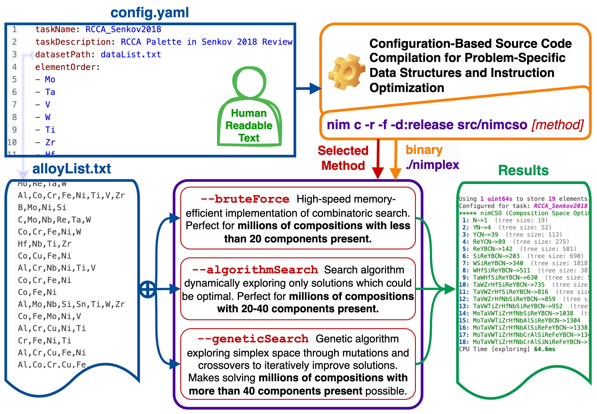

# Summary

`nimCSO` is a high-performance tool implementing several methods for selecting components (data dimensions) in compositional datasets which optimize the data availability and density for applications such as machine learning. Making said choice is a combinatorically hard problem for complex compositions existing in highly dimensional spaces due to the interdependency of components being present. Such spaces are often encountered in materials science, where, for instance, datasets on Compositionally Complex Materials (CCMs) often span 20-45 chemical elements, 5-10 generalized processing histories, and several temperature regimes, for up to 60 total data components.

At its core, `nimCSO` leverages the metaprogramming ability of the Nim language [@Rumpf2023] to optimize itself at the compile time, both in terms of speed and memory handling, to the specific problem statement and dataset at hand based on a human-readable configuration file. As demonstrated in [Methods and Performance](#methods-and-performance) section, `nimCSO` can outperform native Python implementation over 400 times in terms of speed and 50 times in terms of memory usage (not counting interpreter), while also outperforming NumPy implementation 35 and 17 times, respectively, when checking a candidate solution.

This tool employs a set of methods, ranging from (1) brute-force search through (2) genetic algorithms to (3) a newly designed search method. They use custom data structures and procedures written in Nim language, which are compile-time optimized for the specific problem statement and dataset pair, which allows nimCSO to run faster and use 1-2 orders of magnitude less memory than general-purpose data structures. All configuration is done with a simple human-readable config file, allowing easy modification of the search method and its parameters.

# Statement of Need

`nimCSO` is an interdisciplinary tool applicable to any field where data is composed of a large number of independent components and their interaction is of interest in a modeling effort, ranging from social sciences like economics, through medicine where drug interactions can have a large impact on the treatment, to chemistry and materials science, where the composition and processing history are critical to resulting properties. The latter has been the root motivation for the development of `nimCSO` within the [**ULTERA Project**](https://ultera.org) (ultera.org) carried under the [**US DOE ARPA-E ULTIMATE**](https://arpa-e.energy.gov/?q=arpa-e-programs/ultimate) program which aims to develop a new generation of ultra-high temperature materials for aerospace applications, through generative machine learning models [@Debnath2021] driving thermodynamic modelling and experimentation [@Li2024].

One of the most promising materials for these applications are Compositionally Complex Materials (CCMs), and their matal-focused subset of Refractory High Entropy Alloys (RHEAs), which are quickly growing since first proposed by [@Cantor2004] and [@Yeh2004]. Contrary to most traditional alloys, they contain a large number of chemical elements (typically 4-9) in similar proportions, in hope to thermodynamically stabilize the material by increasing its configurational entropy ($\Delta S_{conf} = \Sigma_i^N x_i \ln{x_i}$ for ideal mixing of $N$ elements with fractions $x_i$), what encourages sampling a large palette of chemical elements. The resulting compositional spaces are both extremely vast and challenging to explore in terms of possible changes [@Krajewski2024Nimplex]; thus, it becomes critical to answer the question like *"Which combination of 15 elements out of 60 in the dataset will result in the largest dataset?"* which has $\binom{60}{15}$ or 53 trillion possible solutions.

# Methods and Performance

## Overview

{width="300pt"}

The metaprogramming employed in nimCSO allows for static optimization of the code at the compile time.

The 

| Method | Time per Dataset | Time per Entry | Relative Speed | Database Size | Relative Size |
|:-------|:----------------:|:--------------:|:--------------:|:-------------:|:-------------:|
| Native `Python` (3.11) | 327.4 µs | 152.3 ns | x1    | 871.5 kB | x1    |
| `NumPy` (1.26)         | 40.1 µs  | 18.6 ns  | x8.3  | 79.7 kB  | x10.9 |
| `nimCSO` (`BitArray`)  | 9.2 µs   | 4.4 ns   | x34.6 | 50.4 kB  | x17.3 |
| `nimCSO` (`uint64`)    | 0.79 µs  | 0.37 ns  | x413  | 16.8 kB  | x52   |

Table: Benchmarks of (1) average time to evaluate how many datapoints would be lost if 5 selected components were removed from a dataset with 2,150 data points spanning 37 components, averaged over 10,000 runs, and (2) the size of the data structure representing the dataset. Values were obtained by running scripts in `benchmarks` directory on Apple M2 Max CPU.

## Brute-Force Search

## Algorithmic Search

For highly dimensional problems (>20), the brute force search becomes suboptimal, prompting the need for a more efficient method. The algorithm implemented in `nimCSO` (see `algorithmSearch()`) iteratively expands and evaluates candidates from a priority queue (implemented through an efficient binary heap [@Williams1964]), while leveraging the fact that *the number of data points lost when removing elements `A` and `B` from the dataset has to be at least as large as when removing either `A` or `B` alone* to delay exploration of candidates until they can contribute to the solution. Furthermore, to (1) avoid revisiting the same candidate without keeping track of visited states and (2) further inhibit the exploration of unlikely candidates, the algorithm *assumes* that while searching for a given order of solution, elements present in already expanded solutions will not improve those not yet expanded. This effectively prunes candidate branches requiring two or more levels of backtracking. This method has generated the same results as combinatoric brute forcing in our tests, except for occasional differences in the last explored solution.

## Genetic Search

The [algorithm-based](#algorithmic-search) method is an efficient for problems with up to 40 elements with a certain level of guaranteed optimality by design, however for higher dimensionality of the problem it will likely run out of memory on most systems. The genetic search method implemented in `nimCSO` (see `geneticSearch()`) is a evolution strategy to iteratively improve solutions based on custom `mutate` and `crossover` procedures. Both procedures are of uniform type [@Goldberg1989] with additional constraint of Hamming weight [@Knuth] preservation in order to preserve order (number of considered elements) of parents and offspring. In `mutate` this is achieved by using purely random bit swapping, rather than more common flipping, as demonstrated in the Figure \ref{fig:mutate}.

{width="100pt"}

# Acknowledgements

This work has been funded through grants: **NSF-POSE FAIN-2229690**, **ONR N00014-23-2721**, and **DOE-ARPA-E DE-AR0001435**. 

We would also like to acknowledge Dr. Jonathan Siegel at Texas A&M University for valuable discussions and feedback on the project.

# References